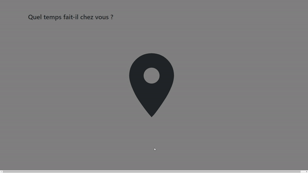

# Weather-app

[](https://www.codacy.com?utm_source=github.com&amp;utm_medium=referral&amp;utm_content=Skyrona/Weather-app&amp;utm_campaign=Badge_Grade)


Geolocalize your PC and display the weather where you are.

## Demo
------



## How to use 
------
Clone the repo

```
git clone https://github.com/Skyrona/Weather-app.git
```

Install the dependencies with npm 
```
npm install
```

To start the development server:
```
npm start
```

Normally your browser should open automatically, if it doesn't, simply navigate to localhost:3000 in your browser.